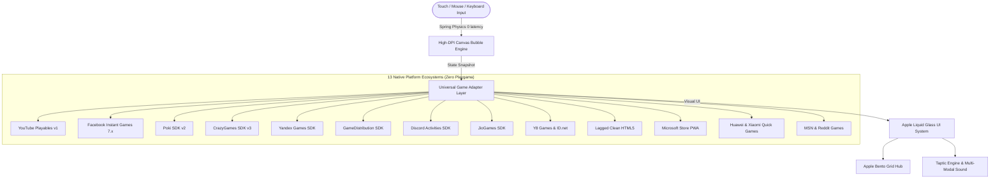

<div align="center">

# 🫧 Bubble Pop Blast · Universal Platform Universe

### One Canvas Game. 13 Native Web Gaming Ecosystems.
#### Crafted with Apple Liquid Glass Design & Fluid Motion Physics

[](https://github.com/Rahul08319/game-verse-creator-guide)
[](https://developers.google.com/youtube/gaming/playables)
[](https://developers.facebook.com/docs/games/instant-games)
[](https://sdk.poki.com)
[](https://docs.crazygames.com)
[](https://discord.com/developers/docs/activities/overview)
[](https://yandex.ru/dev/games/doc)

**Match Bubbles · Trigger Combos · Defeat Bosses · Monopolize 13 App Stores & Portals**

*Zero Playgama or third-party SDK dependencies — 100% pure native platform integrations.*

---

[🎮 Launch Game](http://localhost:8080) &nbsp;·&nbsp; [ Platform Universe Hub](http://localhost:8080/platforms) &nbsp;·&nbsp; [🏆 Leaderboards](http://localhost:8080/leaderboard) &nbsp;·&nbsp; [🧪 Test Suite](https://developers.google.com/youtube/gaming/playables/test_suite)

</div>

---

##  Apple Design System Architecture

Bubble Pop Blast is built with Apple’s **Liquid Glass**, **SF Typography**, and **Fluid Interface Motion** (WWDC 2018 & 2026 design principles translated for the modern web):

<div align="center">



</div>

### 🎨 Design Highlights

- **Liquid Glass Materials**: Real-time `backdrop-filter: blur(24px) saturate(180%)` with specular top edge highlights, multi-layer depth, and adaptive light scattering.
- **Continuous Squircle Curvature**: Smooth G2 continuous curves across cards, badges, and overlays.
- **Physical Spring Animations**: Critically damped spring physics (`damping: 1.0`, `response: 0.35s`) for UI, plus momentum flick projection on canvas bubbles.
- **Apple Bento Grid Hub**: Dedicated `/platforms` route showcasing all 13 platforms with real-time capability tags, SDK inspect consoles, and one-click launch.
- **Multi-Modal Harmony**: Synchronized audio chimes and Taptic Engine vibration haptics fired on the same frame as visual pops.

---

## 🌐 13 Native Platform Editions

Every platform edition is built **directly against the vendor's official SDK specification** without Playgama or middleman wrappers:

| Platform | Category | SDK Target | Cloud Save | Ads (Mid/Reward) | Leaderboards | Offline PWA |
|---|---|---|:---:|:---:|:---:|:---:|
| **YouTube Playables** | Video & TV | `ytgame` v1 | ✅ UTF-16 (<3MB) | ✅ Interstitial + Rewarded | ✅ Highest Score | ❌ |
| **Facebook Instant Games** | Social & Messenger | `FBInstant` 7.x | ✅ `setDataAsync()` | ✅ Interstitial + Rewarded | ✅ Native Graph | ❌ |
| **Poki** | Web Portal | `PokiSDK` v2 | 💾 LocalStorage | ✅ `commercialBreak` + `rewardedBreak` | ❌ | ✅ |
| **CrazyGames** | Web Portal | `CrazyGames.SDK` v3 | 💾 LocalStorage | ✅ Midgame + Rewarded | ❌ | ✅ |
| **Yandex Games** | Web Portal & Mobile | `YaGames` SDK | ✅ Player Data | ✅ `showFullscreen` + `showRewarded` | ✅ LeaderboardAPI | ❌ |
| **GameDistribution** | Global Network | `GD_OPTIONS` HTML5 | 💾 LocalStorage | ✅ `gdsdk.showAd()` | ❌ | ✅ |
| **Discord Activities** | Voice & Chat | Embedded App SDK | 💾 LocalStorage | ❌ | ✅ Rich Presence | ❌ |
| **JioGames** | Telecom & STB | `JioGames` SDK | ✅ Key-Value | ✅ Interstitial + Rewarded | ✅ Leaderboard | ✅ |
| **Y8 Games** | Web Arcade | `Y8` / ID.net | 💾 LocalStorage | ✅ `showAd()` | ✅ ID.net Tables | ✅ |
| **Lagged** | Web Arcade | Clean HTML5 | 💾 LocalStorage | ❌ | ❌ | ✅ |
| **Microsoft Store** | Desktop Windows 11 | WinRT PWA Manifest | ✅ `localSettings` | ❌ | ❌ | ✅ |
| **Huawei & Xiaomi** | Mobile Quick App | Quick App `hbs` / `miapp` | ✅ `system.storage` | ❌ | ❌ | ✅ |
| **MSN & Reddit Games** | iFrame Syndication | `postMessage` protocol | 💾 LocalStorage | ❌ | ✅ PostMessage | ✅ |

---

## 🚀 Quick Launch & Platform Switching

### Option 1: Automatic Environment Detection
The engine automatically detects the runtime environment at load time:
- Inside YouTube iframe → Activates **YouTube Playables SDK**
- Inside Facebook Messenger/Feed → Activates **Facebook Instant Games SDK**
- Inside Poki portal → Activates **Poki SDK**
- Inside Discord voice chat → Activates **Discord Embedded App SDK**
- ...and so on.

### Option 2: URL Query Parameter Override
Simulate or target any platform directly in your browser:
```bash
# Test Poki Edition
http://localhost:8080/?platform=poki

# Test YouTube Playables Edition
http://localhost:8080/?platform=youtube

# Test Facebook Instant Games Edition
http://localhost:8080/?platform=facebook

# Test CrazyGames Edition
http://localhost:8080/?platform=crazygames

# Test Yandex Games Edition
http://localhost:8080/?platform=yandex

# Test Discord Activities Edition
http://localhost:8080/?platform=discord
```

### Option 3: In-Game Apple Platform Switcher
Click the **** or **🌐** button in the game header to open the interactive **Platform Universe Modal** to switch engines on the fly without refreshing.

---

## 🛠️ Local Development & Build Commands

```bash
# 1. Install dependencies
npm install

# 2. Run local development server with strict YouTube Playables CSP headers
npm run dev

# 3. Build optimized production bundle
npm run build

# 4. Run official YouTube Playables preflight audit
npm run check:playables

# 5. Package standalone distribution bundles for all 13 platforms
npm run build:platforms
```

### Preflight Verification Results
```text
── Bubble Pop Blast · YouTube Playables Preflight ──────────────
  Files            : 26 / 8,000 max
  Initial bundle   : 0.69 MiB / 15 MiB limit
  Total bundle     : 0.84 MiB / 250 MiB limit
  SDK load order   : ✅ OK — SDK before game bundle
  Invalid names    : ✅ none
  Oversized files  : ✅ none
─────────────────────────────────────────────────────────────────
✅ Preflight PASSED.
```

---

## 💰 Multi-Platform Monetization Blueprint

```text
┌──────────────────────────────────────────────────────────────────────────┐
│                    Universal Monetization Flow                           │
├────────────────────────────────┬─────────────────────────────────────────┤
│  Level Complete / Game Over    │  requestInterstitialAd()                │
│                                │  • YouTube: ytgame.ads.requestInter...  │
│                                │  • Poki: PokiSDK.commercialBreak()      │
│                                │  • CrazyGames: requestAd('midgame')     │
│                                │  • Yandex: ysdk.adv.showFullscreenAdv() │
│                                │  • Facebook: getInterstitialAdAsync()   │
│                                │  • 45s cooldown across all platforms    │
├────────────────────────────────┼─────────────────────────────────────────┤
│  Game Over +1 Life Offer       │  requestRewardedAd("extra-life-reward") │
│                                │  • Grants +1 life on ad completion      │
│                                │  • Non-blocking with error fallback     │
└────────────────────────────────┴─────────────────────────────────────────┘
```

---

## 🛡️ Content Security Policy (CSP)

The Vite development server is configured with YouTube's official CSP header to catch network violations locally:

```text
default-src 'none';
script-src 'report-sample' 'self' 'unsafe-eval' 'unsafe-inline' blob:
  https://www.youtube.com/game_api/v0
  https://www.youtube.com/game_api/v0/
  https://www.youtube.com/game_api/v1
  https://www.youtube.com/game_api/v1/;
object-src 'none';
style-src 'self' 'unsafe-inline' https://fonts.googleapis.com;
img-src 'self' blob: data:;
media-src 'self' blob:;
font-src 'self' data: https://fonts.googleapis.com https://fonts.gstatic.com;
connect-src 'self' blob: data:;
sandbox allow-pointer-lock allow-same-origin allow-scripts;
base-uri 'self';
manifest-src 'self';
worker-src 'self' blob:
```

---

## 📂 Project Architecture

```text
game-verse-creator-guide/
├── index.html                   # YouTube Playables SDK tag (loaded FIRST)
├── vite.config.ts               # Vite bundler with enforced Playables CSP
├── scripts/
│   └── check-playables.mjs      # Strict bundle preflight validation
├── src/
│   ├── App.css                  # Apple Liquid Glass design system & SF typography
│   ├── App.tsx                  # Router (/ for game, /platforms for universe hub)
│   ├── types/
│   │   └── ytgame.d.ts          # 100% complete official YouTube Playables types
│   ├── platforms/               # 13 Native Platform Adapters (No Playgama)
│   │   ├── base.ts              # Universal GameAdapter interface & LocalAdapter
│   │   ├── index.ts             # Auto-detector, catalog & override system
│   │   ├── youtube.ts           # YouTube Playables adapter
│   │   ├── facebook.ts          # Facebook Instant Games adapter
│   │   ├── poki.ts              # Poki SDK v2 adapter
│   │   ├── crazygames.ts        # CrazyGames SDK v3 adapter
│   │   ├── yandex.ts            # Yandex Games SDK adapter
│   │   ├── gamedistribution.ts  # GameDistribution adapter
│   │   ├── discord.ts           # Discord Activities adapter
│   │   ├── jiogames.ts          # JioGames SDK adapter
│   │   ├── y8.ts                # Y8 Games & ID.net adapter
│   │   ├── lagged.ts            # Lagged HTML5 adapter
│   │   ├── microsoft.ts         # Microsoft Store PWA adapter
│   │   ├── huawei.ts            # Huawei & Xiaomi Quick Games adapter
│   │   └── msn.ts               # MSN & Reddit iFrame postMessage adapter
│   ├── components/
│   │   ├── PlatformSwitcherOverlay.tsx # Apple Liquid Glass quick switcher
│   │   ├── GameCanvas.tsx       # 60fps High-DPI bubble shooting engine
│   │   └── GameUI.tsx           # Responsive game chrome & stats
│   ├── pages/
│   │   ├── Index.tsx            # Main game controller & platform wiring
│   │   └── PlatformHub.tsx      # Apple Bento Grid 13-Platform Showcase
│   └── utils/
│       ├── youtubePlayables.ts  # Defensive YouTube Playables SDK helper
│       ├── soundManager.ts      # Multi-modal audio synthesizer
│       └── haptics.ts           # Taptic Engine vibration controller
```

---

## 🎮 Controls

| Action | Control |
|---|---|
| **Aim & Shoot** | Mouse Click / Touch Drag & Release |
| **Toggle Fullscreen** | `F` key |
| **Close Overlay** | `Esc` key |
| **Switch Platform** | Click **** icon in toolbar |
| **Universe Hub** | Click **🌐** icon in toolbar |

---

## 📄 License & Publishing

Built for worldwide publishing across web arcades, social networks, mobile super-apps, and desktop stores. Add an MIT or commercial license before third-party distribution.

<div align="center">

Made with 🫧 and  Apple Design Foundations for [Rahul08319/game-verse-creator-guide](https://github.com/Rahul08319/game-verse-creator-guide)

</div>
