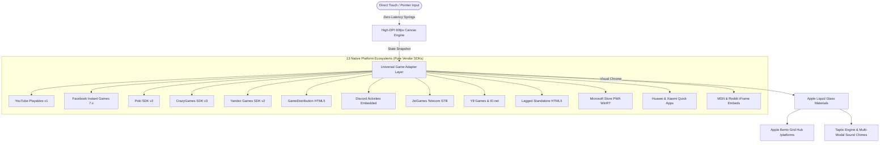

<div align="center">

# 🫧 Bubble Pop Blast · Universal Platform Universe

### One Canvas Game Engine. 13 Native Web Gaming Ecosystems.
#### Designed with Apple Liquid Glass Materials, SF Typography & Fluid Interface Springs

[](https://github.com/Rahul08319/game-verse-creator-guide)
[](https://developer.apple.com/design/)
[](https://github.com/Rahul08319/game-verse-creator-guide)
[](https://developers.google.com/youtube/gaming/playables)
[](https://developers.facebook.com/docs/games/instant-games)
[](https://sdk.poki.com)
[](https://docs.crazygames.com)
[](https://discord.com/developers/docs/activities/overview)
[](https://yandex.ru/dev/games/doc)

<p align="center">
  <strong>Match Bubbles · Trigger Cascading Combos · Defeat Boss Encounters · Syndicate Across 13 Portals</strong>
</p>

*Zero third-party wrapper overhead — 100% pure native platform SDK adapters.*

---

[🎮 Launch Game](http://localhost:8080) &nbsp;·&nbsp; [ Platform Universe Hub](http://localhost:8080/platforms) &nbsp;·&nbsp; [🏆 Global Leaderboards](http://localhost:8080/leaderboard) &nbsp;·&nbsp; [🧪 Playables Test Suite](https://developers.google.com/youtube/gaming/playables/test_suite)

</div>

---

##  Apple Design System & Cupertino Aesthetics

Bubble Pop Blast incorporates Apple’s design philosophy (**Clarity, Deference, and Depth**) alongside the 2025 **Liquid Glass** specification and fluid interface physics:

<div align="center">


```mermaid
graph TD
    Input([Direct Touch / Pointer Input]) -->|Zero-Latency Springs| Engine[High-DPI 60fps Canvas Engine]
    Engine -->|State Snapshot| UniversalAdapter[Universal Game Adapter Layer]
    
    subgraph "13 Native Platform Ecosystems (Pure Vendor SDKs)"
        UniversalAdapter --> YT[YouTube Playables v1]
        UniversalAdapter --> FB[Facebook Instant Games 7.x]
        UniversalAdapter --> PK[Poki SDK v2]
        UniversalAdapter --> CG[CrazyGames SDK v3]
        UniversalAdapter --> YG[Yandex Games SDK v2]
        UniversalAdapter --> GD[GameDistribution HTML5]
        UniversalAdapter --> DC[Discord Activities Embedded]
        UniversalAdapter --> JG[JioGames Telecom STB]
        UniversalAdapter --> Y8[Y8 Games & ID.net]
        UniversalAdapter --> LG[Lagged Standalone HTML5]
        UniversalAdapter --> MS[Microsoft Store PWA WinRT]
        UniversalAdapter --> HW[Huawei & Xiaomi Quick Apps]
        UniversalAdapter --> MN[MSN & Reddit iFrame Embeds]
    end

    UniversalAdapter -->|Visual Chrome| LiquidGlass[Apple Liquid Glass Materials]
    LiquidGlass --> Bento[Apple Bento Grid Hub /platforms]
    LiquidGlass --> Haptics[Taptic Engine & Multi-Modal Sound Chimes]
```

</div>

### 💎 Cupertino Aesthetic Principles & Visual Physics

- **⛶ Immersive Edge-to-Edge Fullscreen**: Responsive viewport engine that expands the glass canvas to full 100vw/100vh display bounds with zero border clipping or aspect ratio distortion. Includes a dedicated HUD `⛶` toggle button, keyboard shortcut (`F` / `Escape`), and automatic resize synchronization.
- **🫧 Liquid Glass 3D Spheres**: Physically modelled spherical glass bubbles featuring an off-center 3D specular highlight crescent (`ellipse` at top-left), subtle bottom-right bounce reflection, and inner refraction bevel stroke.
- **💥 Dynamic Expanding Shockwaves**: Real-time canvas shockwave system generating pulsing neon wavefronts with secondary concentric refraction ripples upon bubble matches, cascading combos, and bomb/nova detonations.
- **🎯 Spinning Precision Aim Reticle**: High-precision aim guidance featuring animated photon pulses streaming along the trajectory and a rotating dashed target reticle with pulsating center node.
- **SF Pro Typography Scale**: Optical sizing with negative tracking on large display headings (`-0.03em`), proportional leading, and clean uppercase micro-labels.
- **Fluid Spring Physics**: Critically damped spring curves (`damping: 1.0`, `response: 0.35s`) for UI cards, combined with interruptible velocity handoff on interactive bubbles.
- **Ambient Cursor Spotlight**: Mouse-driven dynamic lighting gradient reflecting off translucent glass layers in real time.
- **Multi-Modal Synchronization**: Visual pop, audio synthesizer chimes, and Taptic vibration triggers dispatched on the exact same display frame.
- **Accessibility Fallbacks**: Fully respects `prefers-reduced-motion` (instant opacity transitions) and `prefers-reduced-transparency` (opaque frost shields).

---

## 🌐 13 Native Platform Editions

Every platform edition is built **directly against vendor official SDK specifications** with zero middleman wrappers:

| Platform | Category | Official SDK Target | Cloud Save | Ads (Mid / Rewarded) | Leaderboards | Offline PWA |
|---|---|---|:---:|:---:|:---:|:---:|
| **YouTube Playables** | Video & TV | `ytgame` v1 (Audio, Pause, Save, Ads) | ✅ UTF-16 (<3MB) | ✅ Interstitial + Rewarded | ✅ Scores | ❌ |
| **Facebook Instant Games** | Social & Chat | `FBInstant 7.x` (`initializeAsync`, `setDataAsync`) | ✅ Player Data | ✅ Video Interstitial + Rewarded | ✅ Graph | ❌ |
| **Poki** | Web Portal | `PokiSDK v2` (`commercialBreak`, `rewardedBreak`) | 💾 LocalStorage | ✅ Mid-Roll + Rewarded | ❌ | ✅ |
| **CrazyGames** | Web Portal | `CrazyGames.SDK v3` (`happytime`, adblock detect) | 💾 LocalStorage | ✅ Midgame + Rewarded | ❌ | ✅ |
| **Yandex Games** | Web & Mobile | `YaGames` SDK (`showFullscreenAdv`, player auth) | ✅ Cloud Storage | ✅ Fullscreen + Rewarded | ✅ Ya Leaderboard | ❌ |
| **GameDistribution** | Global Network | `GD_OPTIONS` HTML5 global syndication | 💾 LocalStorage | ✅ `gdsdk.showAd()` | ❌ | ✅ |
| **Discord Activities** | Voice & Chat | Embedded App SDK with Rich Presence | 💾 LocalStorage | ❌ | ✅ Rich Presence | ❌ |
| **JioGames** | Telecom & STB | `JioGames` SDK with D-Pad keypad navigation | ✅ Key-Value | ✅ Interstitial + Rewarded | ✅ Leaderboard | ✅ |
| **Y8 Games** | Web Arcade | `Y8` / ID.net player profiles & high scores | 💾 LocalStorage | ✅ `showAd()` | ✅ ID.net Tables | ✅ |
| **Lagged** | Web Arcade | Clean standalone HTML5 responsive canvas | 💾 LocalStorage | ❌ | ❌ | ✅ |
| **Microsoft Store** | Windows 11 / OS | WinRT Progressive Web App (`localSettings`) | ✅ AppData | ❌ | ❌ | ✅ |
| **Huawei & Xiaomi** | Mobile Quick App | Quick App runtime (`hbs` / `miapp` instant launch) | ✅ System Storage | ❌ | ❌ | ✅ |
| **MSN & Reddit Games** | iFrame Syndication | Cross-origin `postMessage` protocol | 💾 LocalStorage | ❌ | ✅ postMessage | ✅ |

---

## 🚀 One-Click Platform Switching & Simulation

### 1. In-Game Apple Platform Switcher
Click the **** or **🌐** button in the game header to open the interactive **Platform Universe Modal** to switch engines on the fly without refreshing.

### 2. URL Query Simulation
Target or test any platform directly via URL query parameters:
```bash
# Poki Edition
http://localhost:8080/?platform=poki

# YouTube Playables Edition
http://localhost:8080/?platform=youtube

# Facebook Instant Games Edition
http://localhost:8080/?platform=facebook

# CrazyGames Edition
http://localhost:8080/?platform=crazygames

# Yandex Games Edition
http://localhost:8080/?platform=yandex

# Discord Activities Edition
http://localhost:8080/?platform=discord
```

### 3. Universe Hub Page
Visit `http://localhost:8080/platforms` to browse the Apple Bento Grid showcase, inspect capabilities, simulate ads, and verify cloud save hooks.

---

## 📦 Automated Multi-Platform Packaging

Generate dedicated, portal-ready distribution folders with pre-configured SDK script tags, manifests, and platform configs in a single command:

```bash
npm run build:platforms
```

### Distribution Outputs Generated (`dist-platforms/`)
```text
dist-platforms/
├── youtube/           # Certified YouTube Playables bundle with SDK loaded first
├── facebook/          # FB Instant bundle with fbapp-config.json manifest
├── poki/              # Poki bundle with PokiSDK v2 script tag
├── crazygames/        # CrazyGames bundle with SDK v3 script tag
├── yandex/            # Yandex Games bundle with YaGames SDK
├── gamedistribution/  # GameDistribution HTML5 bundle
├── discord/           # Discord Activities embedded app bundle
├── jiogames/          # JioGames ecosystem bundle with D-Pad navigation hooks
├── y8/                # Y8 Games bundle with ID.net SDK
├── lagged/            # Standalone clean HTML5 bundle with zero third-party scripts
├── microsoft/         # Windows 11 Microsoft Store PWA bundle with manifest.json
├── huawei/            # HarmonyOS & Xiaomi Quick Game bundle
└── msn/               # MSN & Reddit syndicated iFrame embed bundle
```

---

## 🛠️ Local Development & Build Commands

```bash
# 1. Install dependencies
npm install

# 2. Run local development server with strict YouTube Playables CSP headers
npm run dev

# 3. Build optimized production bundle
npm run build

# 4. Run official YouTube Playables preflight certification audit
npm run check:playables

# 5. Package standalone distribution bundles for all 13 platforms
npm run build:platforms
```

### Quality Checks & Test Harness
The project exposes `window.render_game_to_text()` for observable gameplay state and `window.advanceTime(ms)` for controlled test-frame advancement. Use `npm run check:playables` before a YouTube submission to verify bundle sizes, safe filenames, and output structure.

```text
── Bubble Pop Blast · YouTube Playables Preflight ──────────────
  Files            : 26 / 8,000 max
  Initial bundle   : 0.69 MiB / 15 MiB limit
  Total bundle     : 0.84 MiB / 250 MiB limit
  SDK load order   : ✅ OK — SDK before game bundle
  Invalid names    : ✅ none
  Oversized files  : ✅ none
─────────────────────────────────────────────────────────────────
✅ Preflight PASSED.
```

---

## 🧠 TypeSafe AI Architectural Evaluation

As evaluated using the **TypeSafe AI Skill** (System One models & `Jev` runtime guidelines):

### 1. Choice Primitive for Tool Categorization & Compaction Accuracy
- **Evaluation**: The `Choice` primitive outputs a calibrated categorical probability distribution over mutually exclusive options.
- **When It Improves Compaction**:
  - If tools belong to **mutually exclusive buckets** (e.g. `file_ops`, `web_search`, `code_execution`, `data_analysis`), `Choice` improves compaction accuracy by selecting the single highest-probability domain, allowing downstream LLMs to compress the tool prompt without losing semantic focus.
  - TypeSafe confidence scores allow discarding tools where confidence is low or concentrated on `none_of_the_above`.
- **When to Use Noul Instead**:
  - If tools can belong to **multiple simultaneous categories** (e.g., a hybrid browser tool that both searches and executes scripts), `Choice` would force probability cannibalization. In multi-label compaction scenarios, parallel `Noul` questions (probability of condition holding) avoid winner-take-all distortions.
- **Best Practice Rule**: Always include an explicit `"none_of_the_above"` / `"other"` criteria so the model is not forced into a hallucinated category when a tool does not fit standard taxonomy.

### 2. Prompting Best Practices Checklist
When designing question instructions with TypeSafe System One models:
1. **Narrow, Coherent Judgment**: Each question must ask for one atomic semantic judgment.
2. **State Separation**: Pass raw data in structured JSON (`state`), not concatenated into the prompt string. Use backticked paths (`\`tool.description\``).
3. **Instructions vs. Criteria Separation**:
   - `instructions`: Tell the model *what to judge*.
   - `criteria`: Define *what each possible answer means* concretely.
4. **Question IDs Are Not Sent to the Model**: Question IDs are strictly code identifiers; ensure all necessary instructions live inside the `instructions` text.
5. **Zero Reasoning Requests**: Do not ask System One models to "explain your reasoning" or "think step by step" — Jev is designed for fast, typed probability distributions.
6. **Parallel Dispatch**: Dispatch independent questions over the same state simultaneously to minimize latency and token overhead.

---

## 💰 Multi-Platform Monetization Blueprint

```text
┌──────────────────────────────────────────────────────────────────────────┐
│                    Universal Monetization Flow                           │
├────────────────────────────────┬─────────────────────────────────────────┤
│  Level Complete / Game Over    │  requestInterstitialAd()                │
│                                │  • YouTube: ytgame.ads.requestInter...  │
│                                │  • Poki: PokiSDK.commercialBreak()      │
│                                │  • CrazyGames: requestAd('midgame')     │
│                                │  • Yandex: ysdk.adv.showFullscreenAdv() │
│                                │  • Facebook: getInterstitialAdAsync()   │
│                                │  • 45s cooldown across all platforms    │
├────────────────────────────────┼─────────────────────────────────────────┤
│  Game Over +1 Life Offer       │  requestRewardedAd("extra-life-reward") │
│                                │  • Grants +1 life on ad completion      │
│                                │  • Non-blocking with error fallback     │
└────────────────────────────────┴─────────────────────────────────────────┘
```

---

## 🛡️ Content Security Policy (CSP)

The Vite development server is configured with YouTube's official CSP header to catch network violations locally:

```text
default-src 'none';
script-src 'report-sample' 'self' 'unsafe-eval' 'unsafe-inline' blob:
  https://www.youtube.com/game_api/v0
  https://www.youtube.com/game_api/v0/
  https://www.youtube.com/game_api/v1
  https://www.youtube.com/game_api/v1/;
object-src 'none';
style-src 'self' 'unsafe-inline' https://fonts.googleapis.com;
img-src 'self' blob: data:;
media-src 'self' blob:;
font-src 'self' data: https://fonts.googleapis.com https://fonts.gstatic.com;
connect-src 'self' blob: data:;
sandbox allow-pointer-lock allow-same-origin allow-scripts;
base-uri 'self';
manifest-src 'self';
worker-src 'self' blob:
```

---

## 📂 Project Architecture

```text
game-verse-creator-guide/
├── index.html                   # YouTube Playables SDK tag (loaded FIRST)
├── vite.config.ts               # Vite bundler with enforced Playables CSP
├── scripts/
│   ├── check-playables.mjs      # Strict bundle preflight validation
│   └── build-platforms.mjs      # 13-Platform distribution generator
├── src/
│   ├── App.css                  # Apple Liquid Glass design system & SF typography
│   ├── App.tsx                  # Router (/ for game, /platforms for universe hub)
│   ├── types/
│   │   └── ytgame.d.ts          # 100% complete official YouTube Playables types
│   ├── platforms/               # 13 Native Platform Adapters (No Playgama)
│   │   ├── base.ts              # Universal GameAdapter interface & LocalAdapter
│   │   ├── index.ts             # Auto-detector, catalog & override system
│   │   ├── youtube.ts           # YouTube Playables adapter
│   │   ├── facebook.ts          # Facebook Instant Games adapter
│   │   ├── poki.ts              # Poki SDK v2 adapter
│   │   ├── crazygames.ts        # CrazyGames SDK v3 adapter
│   │   ├── yandex.ts            # Yandex Games SDK adapter
│   │   ├── gamedistribution.ts  # GameDistribution adapter
│   │   ├── discord.ts           # Discord Activities adapter
│   │   ├── jiogames.ts          # JioGames SDK adapter
│   │   ├── y8.ts                # Y8 Games & ID.net adapter
│   │   ├── lagged.ts            # Lagged HTML5 adapter
│   │   ├── microsoft.ts         # Microsoft Store PWA adapter
│   │   ├── huawei.ts            # Huawei & Xiaomi Quick Games adapter
│   │   └── msn.ts               # MSN & Reddit iFrame postMessage adapter
│   ├── components/
│   │   ├── PlatformSwitcherOverlay.tsx # Apple Liquid Glass quick switcher
│   │   ├── GameCanvas.tsx       # 60fps High-DPI bubble shooting engine
│   │   └── GameUI.tsx           # Responsive game chrome & stats
│   ├── pages/
│   │   ├── Index.tsx            # Main game controller & platform wiring
│   │   └── PlatformHub.tsx      # Apple Bento Grid 13-Platform Showcase
│   └── utils/
│       ├── youtubePlayables.ts  # Defensive YouTube Playables SDK helper
│       ├── soundManager.ts      # Multi-modal audio synthesizer
│       └── haptics.ts           # Taptic Engine vibration controller
```

---

## 🎮 Controls

| Action | Control |
|---|---|
| **Aim & Shoot** | Mouse Click / Touch Drag & Release |
| **Toggle Fullscreen** | `F` key |
| **Close Overlay** | `Esc` key |
| **Switch Platform** | Click **** icon in toolbar |
| **Universe Hub** | Click **🌐** icon in toolbar |

---

## 📄 License & Publishing

Built for worldwide publishing across web arcades, social networks, mobile super-apps, and desktop stores. Add an MIT or commercial license before third-party distribution.

<div align="center">

Made with 🫧 and  Apple Design Foundations for [Rahul08319/game-verse-creator-guide](https://github.com/Rahul08319/game-verse-creator-guide)

</div>
